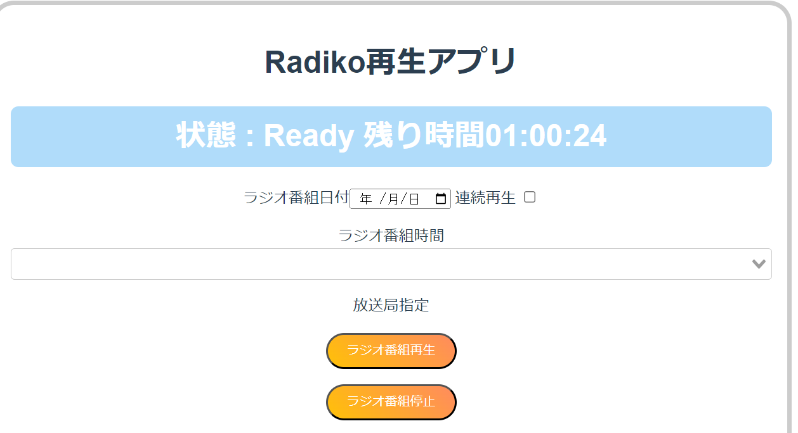

# radiko20230814

## 1 Raspberry pi上にディレクトリを構成する

/home/pi/radiko/ 以下は下記の通りにディレクトリを用意する。

├── be			
│?? ├── radiko		
│?? └── requirements.txt		
├── docker-compose.yml		
├── fe		
│?? ├── Dockerfile
│?? ├── package.json
│?? ├── app	

## 2 コンテナを作成する。

フロントエンド側(fe)はdockerで環境を作る。バックエンド側はRaspberry Pi本体に直接環境を作る。
docker-compose.ymlを実行する

```DockerFile:/home/pi/radikodocker-compose.yml
docker-compose build
docker start fe
```

## 3 フロントエンド側(fe)でVueCliを作成する

```console:/home/pi/radiko
docker exec -it fetest bash
```
```dockershell:/app
vue create radiko
```

Vue CLI v5.0.8
? Please pick a preset:
  Default ([Vue 3] babel, eslint)
? Default ([Vue 2] babel, eslint)  vue2を選択すること
  Manually select features

  ? Please pick a preset: Default ([Vue 2] babel, eslint)
? Pick the package manager to use when installing dependencies:
  Use Yarn
? Use NPM  NPMを選択すること

＊＊＊　途中略　＊＊＊

?  Successfully created project radiko.
?  Get started with the following commands:


vue cli作成完了後、下記のディレクトリが完成している。 **追加と記載したファイルをgithubからダウンロードし書き換える

.
├── Dockerfile
├── app
│   ├── node_modules
│   └── radiko
│       ├── README.md
│       ├── babel.config.js
│       ├── jsconfig.json
│       ├── node_modules
│       ├── package-lock.json
│       ├── package.json
│       ├── public
│       │   ├── favicon.ico
│       │   └── index.html
│       ├── src
│       │   ├── App.vue  **追加
│       │   ├── assets
│       │   │   └── logo.png
│       │   ├── components
│       │   │   ├── HelloWorld.vue 
│       │   │   ├── Kaden.vue **追加
│       │   │   ├── Radiko.vue **追加
│       │   │   └── constrdk.js **追加
│       │   ├── main.js **追加
│       │   └── router.js **追加
│       └── vue.config.js
├── package.json


 $ cd radiko
 $ npm run serve

-> 192.168.xx.xxxx:8080 にアクセスするとWebページが閲覧できる


```dockershell:/app
cd radiko
npm run serve &
```


## 4 バックエンド(be)の環境を整える

下記のモジュールをコンテナではなくホストに直接インストールする

```console:/home/pi/be/radiko
sudo apt-get update
sudo apt-get install lsof
sudo apt-get install -y curl
sudo apt-get install -y cron
sudo apt-get install -y emacs
sudo apt-get install -y tzdata
sudo apt-get install -y chromium
sudo apt-get install -y chromium-driver
sudo apt-get install -y xvfb
sudo apt install -y nodejs npm
sudo npm install python-shell
sudo npm install express
```

beディレクトリ以下のファイル群をgithubより取得、配置する

be
├── Dockerfile
├── radiko
│   ├── __pycache__
│   │   └── setting.cpython-39.pyc
│   ├── const.js
│   ├── index.js
│   ├── kill_processes.sh
│   ├── log.txt
│   ├── mode.csv
│   ├── node_modules
│   ├── package-lock.json
│   ├── package.json
│   ├── radiko copy.csv
│   ├── radiko.csv
│   ├── radiko.py
│   ├── radiko.txt
│   ├── radikoend.py
│   ├── radikoendforce.py
│   ├── radikosample.csv
│   ├── sample.py
│   ├── setting.py
│   ├── vol50.py
│   ├── vol50.sh
│   ├── vol60.py
│   ├── vol60.sh
│   ├── vol70.py
│   ├── vol70.sh
│   ├── vol80.py
│   ├── vol80.sh
│   ├── wfmt.js
│   ├── wrn1.js
│   └── wrn2.js
├── requirements.txt


nodeサーバーを立ち上げる。
```console:/home/pi/be/radiko
node index.js
```

RN1を再生したいとき

```console:/home/pi/be/radiko
node wrn1.js
python3 /home/pi/dcshare/be/radiko/radiko.py
```
RN1を終了したいとき
```console:/home/pi/be/radiko
node wrn1.js
python3 /home/pi/dcshare/be/radiko/radikoendforce.py
```


crontabの書き方

# m h  dom mon dow   command
51 14 * * * /usr/bin/node /home/pi/dcshare/be/radiko/wrn1.js
52 14 * * * /usr/bin/python3 /home/pi/dcshare/be/radiko/radiko.py
22 13 * * * /usr/bin/python3 /home/pi/dcshare/be/radiko/radikoendforce.py
55 14 * * * /home/pi/dcshare/be/radiko/kill_processes.sh